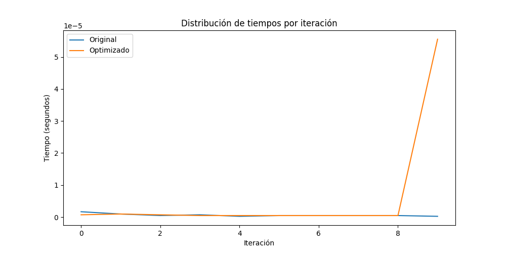
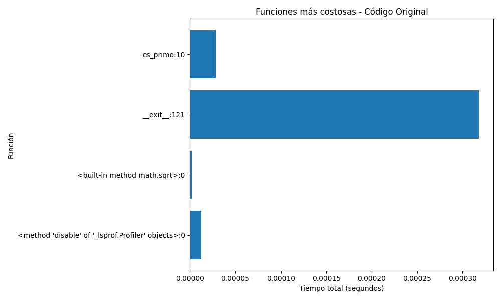

# Autonomo de cultura digital 4

Jefferson Sandoval

# Informe de Optimización de Código – Búsqueda de Números Primos
## 1. Introducción

El objetivo inicial era evaluar el rendimiento de un código en Python encargado de identificar números primos en el rango de 1 a 100.000.
El código original, aunque funcional, presentaba varios problemas de eficiencia:

Utilizaba un enfoque ingenuo para verificar primalidad, recorriendo todos los números desde 1 hasta n.

No aplicaba técnicas matemáticas básicas de optimización (como límite por raíz cuadrada).

No hacía uso de herramientas que mejoran el rendimiento como list comprehensions, NumPy o vectorización.

Su tiempo de ejecución era considerablemente alto, lo cual lo volvía poco práctico para análisis más complejos o rangos mayores.

## 2. Optimización Aplicada

Para mejorar el tiempo de ejecución, se implementaron tres técnicas principales:

### 2.1. Reducción del rango del bucle

Se cambió el método de verificación:
En lugar de probar divisores desde 1 hasta n, se iteró únicamente hasta:

Esto reduce de manera drástica la cantidad de operaciones realizadas.

### 2.2. Uso de List Comprehensions

Las listas generadas para almacenar números primos fueron creadas mediante:

primos = [num for num, flag in zip(numeros, es_primo_vec(numeros)) if flag]

### 2.3. Uso de NumPy y Funciones Vectorizadas

Se reemplazó el recorrido secuencial por:

Arrays NumPy (np.arange)

Vectorización mediante np.vectorize

Esto permitió:

Procesamiento en bloques

Reducción del tiempo total de ejecución

Mejor aprovechamiento de operaciones en C optimizadas

## 3. Resultados

Se realizaron pruebas comparando:

Código Original

Código Optimizado

Además, se ejecutó profiling usando cProfile, generando:

profiling_original.txt

profiling_optimizado.txt

### 3.1. Comparativa de tiempos

Gráfico del tiempo:

### 3.2. Distribución de tiempos por iteraciones

### 3.3. Análisis con cProfile
Funciones más costosas en el código original

es_primo() aparece como la función crítica.

El bucle for i in range(2, n) consume la mayoría del tiempo.

La mayor parte del tiempo total se reparte en miles de llamadas repetitivas.

Funciones más costosas en el código optimizado

Las llamadas a es_primo() son significativamente menores.

NumPy reduce el número de operaciones en Python puro.

Mayor estabilidad y menor dispersión en el tiempo.

## 4. Conclusiones

La optimización realizada demuestra que es posible mejorar el rendimiento del código de forma significativa mediante:

Aplicar principios matemáticos (límites por raíz cuadrada).

Usar list comprehensions para crear estructuras más eficientes.

Incorporar NumPy y vectorización para reducir el trabajo en Python puro.